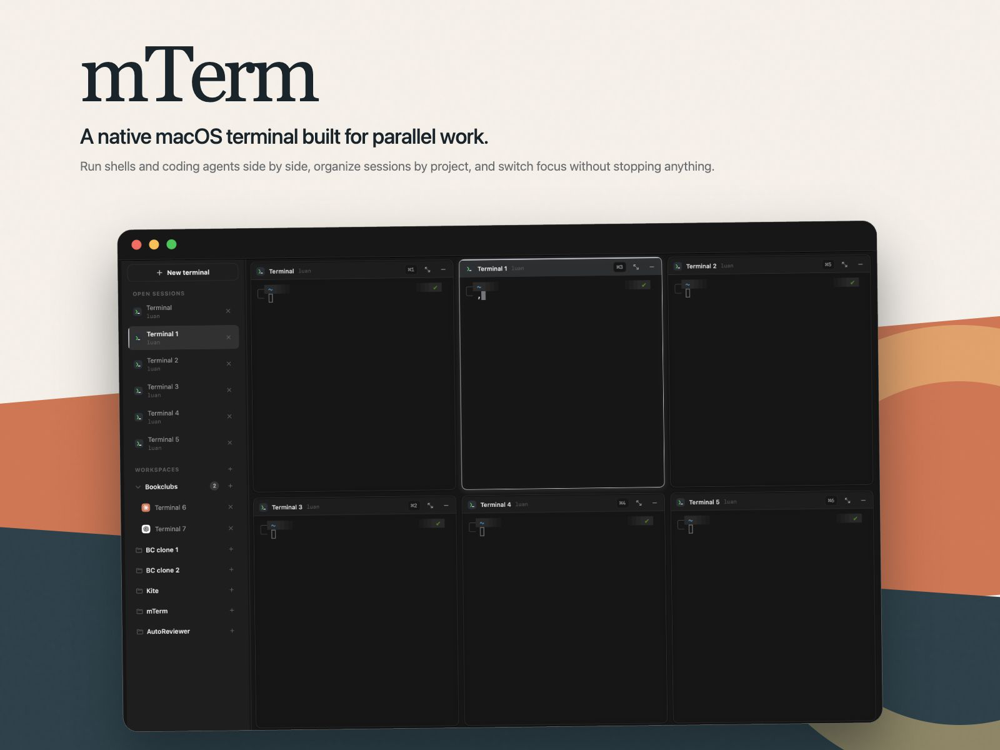
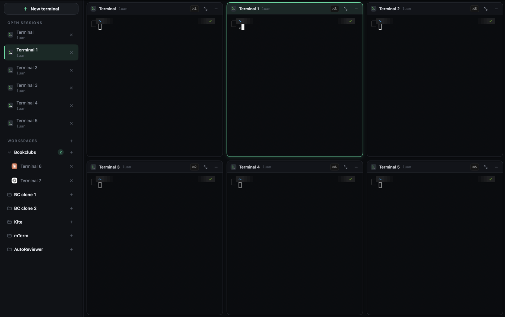
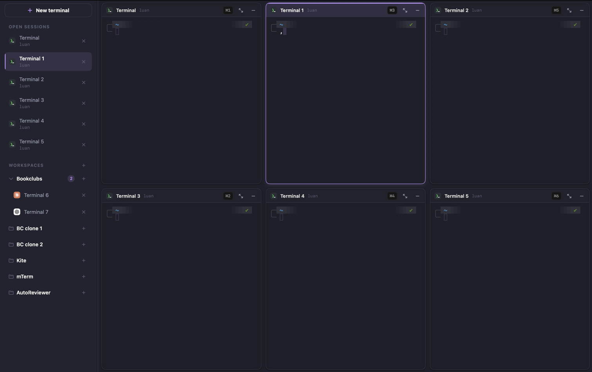
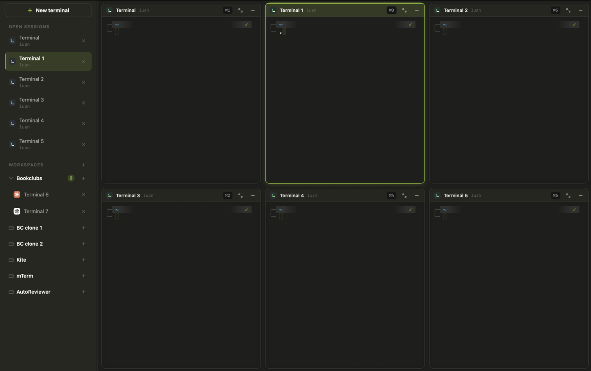
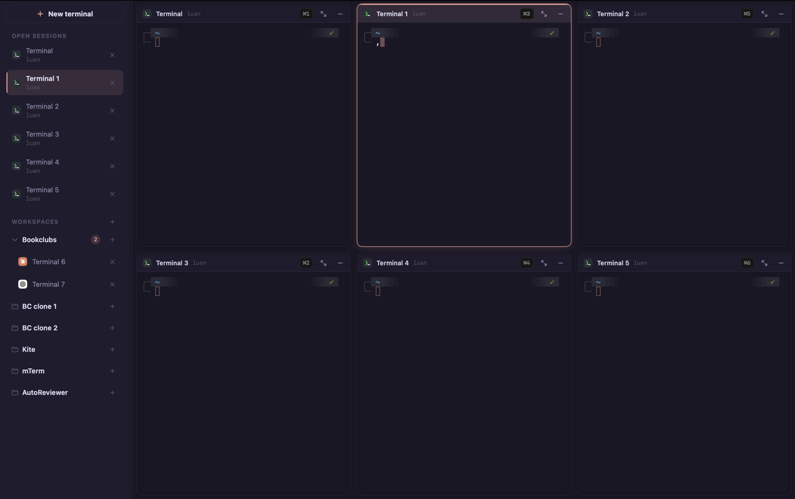
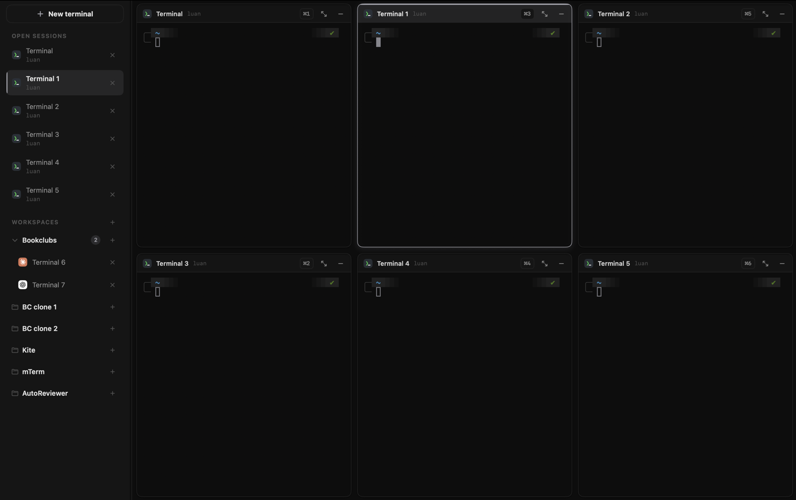
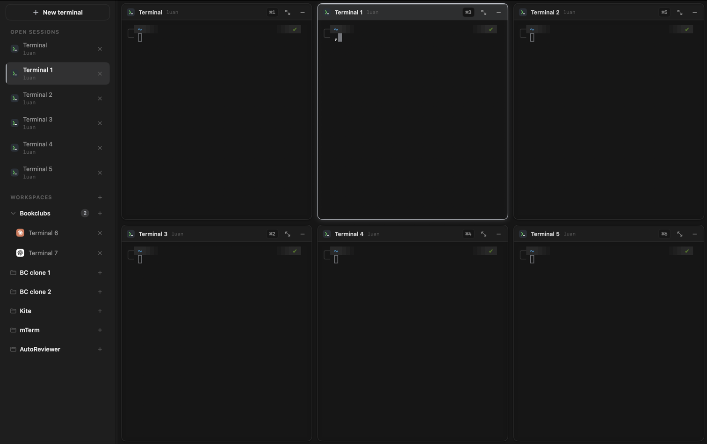
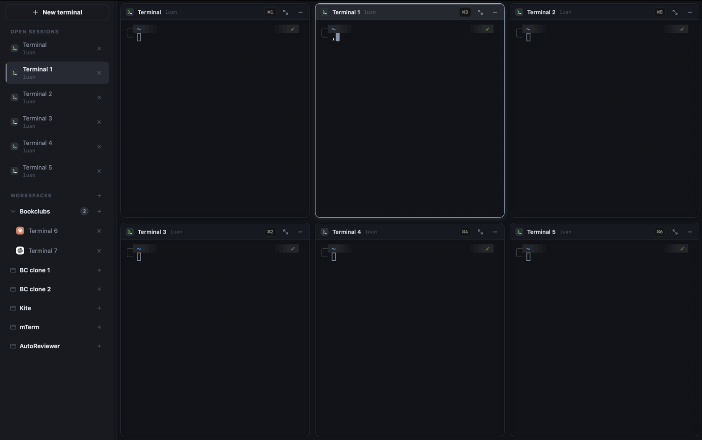
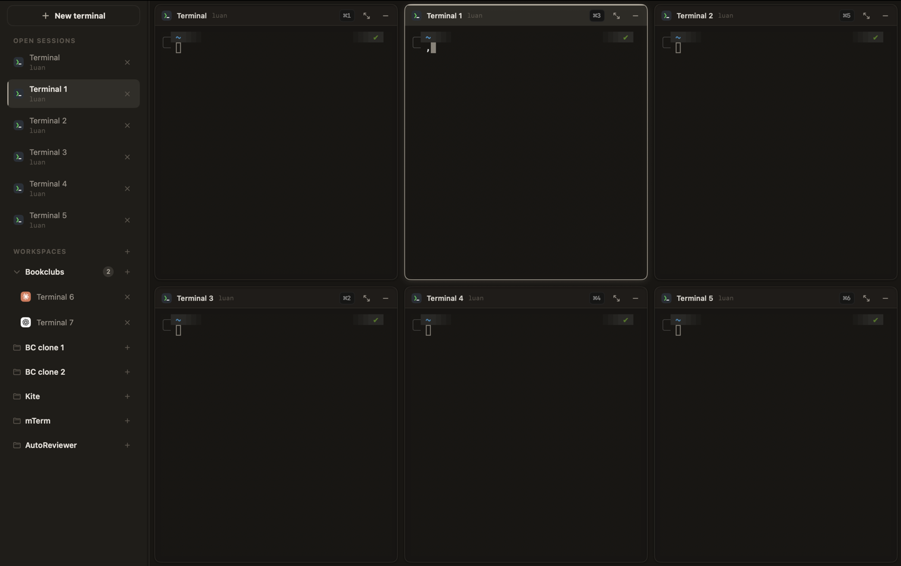

<p align="center">
  
</p>

<p align="center">
  <a href="https://github.com/luanzt/mTerm/releases/latest"></a>&nbsp;
  <a href="https://github.com/luanzt/mTerm/releases"></a>&nbsp;
  &nbsp;
  <a href="#support-mterm"></a>
</p>

<p align="center">
  <a href="#support-mterm"></a>
</p>

<p align="center">
  <strong>A native macOS terminal built for parallel work.</strong><br>
  Run shells and coding agents side by side, organize sessions by project, and switch focus without stopping anything.
</p>

> **Requires macOS 14 (Sonoma) or later**, Apple Silicon or Intel.

## Download

Download the latest `mTerm-<version>.dmg` from
[**GitHub Releases**](https://github.com/luanzt/mTerm/releases/latest), open it,
and drag **mTerm** into your **Applications** folder.

### First launch

mTerm is signed with a self-signed certificate but *not notarized*, so macOS
Gatekeeper will block a normal double-click the first time. Pick whichever is
easiest:

- **Right-click the app ▸ Open**, then confirm in the dialog — once is enough.
- Or System Settings ▸ Privacy & Security ▸ *Open Anyway*.
- Or strip the quarantine flag from Terminal, then open normally:
  ```bash
  xattr -c /Applications/mTerm.app
  ```
  (`xattr -c` clears the `com.apple.quarantine` attribute macOS adds to
  downloaded apps, so Gatekeeper stops blocking it.)

## Highlights

- **Up to six live panes** — build a 3-column × 2-row deck and rearrange it by
  dragging sessions directly onto panes.
- **Project workspaces** — group related sessions under folders and start new
  shells in each project's chosen directory.
- **Nothing stops when hidden** — sessions parked outside the visible grid keep
  their terminal views and shell processes alive.
- **Built for coding agents** — Claude Code and Codex can notify you when they
  need attention, then take you back to the originating session.
- **Fast navigation** — focus panes with ⌘1…⌘6, maximize with ⌥F, and search
  terminal history with ⌘F.
- **Make it yours** — choose from 17 live themes and configure typography and all
  16 ANSI colors independently.

## Themes

Choose a theme in **Settings ▸ Appearance**. Changes apply live across the app
chrome and terminal without restarting your shell.

<table>
  <tr>
    <td width="50%"><strong>Emerald</strong><br></td>
    <td width="50%"><strong>Dracula</strong><br></td>
  </tr>
  <tr>
    <td width="50%"><strong>Monokai</strong><br></td>
    <td width="50%"><strong>Rosé Pine</strong><br></td>
  </tr>
  <tr>
    <td width="50%"><strong>Onyx</strong><br></td>
    <td width="50%"><strong>Graphite</strong><br></td>
  </tr>
  <tr>
    <td width="50%"><strong>Slate</strong><br></td>
    <td width="50%"><strong>Carbon</strong><br></td>
  </tr>
</table>

---

## Using mTerm

mTerm opens with a sidebar and a pane deck. Almost everything is driven by the
mouse; the sidebar is your session and workspace list.

### Sessions & workspace folders
- **New terminal** — click **＋ New terminal** at the top of the sidebar. It
  opens a fresh shell in the active pane; hold ⌘ while clicking to add a pane.
- **Workspace folders** — group related terminals into folders (e.g. one folder
  per project). Add a folder with the **folder ＋** button; opening a terminal
  inside a folder starts it in that folder's chosen directory.
- **Reorder** — drag sessions or folders in the sidebar to rearrange them.
- **Close** — hover a session and click its **✕**, or use its context menu.

### Splitting the pane deck
The deck holds up to **3 columns**, and a column can be split into **2 rows** —
so you can see several shells at once.

- **Drag a session from the sidebar onto a pane** to place it. Drop zones light
  up as you hover:
  - **center** → replace the pane
  - **left / right** → open a new column beside it
  - **top / bottom** → split that column into two rows
- Panes float with small gaps; the layout self-heals if a drag leaves it in an
  odd state.

### Focus & sizing
- **Maximize a pane** — click the **⤢** button in a pane's header to blow it up
  to fill the deck. Click **⤡** to restore the previous layout. Any structural
  change to the grid (adding/closing a pane) clears the saved layout.
- **Resize** — drag the gutter between columns, or between the two rows of a
  split column, to change the split ratios.

### Keyboard
| Shortcut | Action |
|----------|--------|
| **⌘N**   | Create an ungrouped terminal in **Open Sessions**, replacing the focused pane |
| **⇧⌘N**  | Create an ungrouped terminal in another pane; replace the focused pane if all 6 are occupied |
| **⌘T**   | Create a terminal in the focused session's workspace, replacing that pane |
| **⇧⌘T**  | Create a terminal in that workspace in another pane; replace the focused pane if all 6 are occupied |
| **⌘F**   | Search the focused terminal's visible buffer and scrollback |
| **⌘B**   | Toggle the sidebar (also **View ▸ Toggle Sidebar**, or the titlebar button) |
| **⌥F**   | Maximize the focused pane, or restore its previous layout |
| **⌘1…⌘6** | Focus the corresponding visible pane |

> Hidden sessions keep running. A shell parked out of the visible grid is **not**
> killed — its process stays alive so nothing is lost when you swap panes.

---

## Support mTerm

If mTerm makes your day a little easier, you can support its continued development.

<p align="center">
  
</p>

<p align="center"><sub>Scan to support mTerm. Thank you ❤️</sub></p>

---

## Build from source

mTerm is a Swift Package Manager **executable** (not an Xcode `.xcodeproj`). You
need the Swift toolchain that ships with Xcode 15+ (or the standalone toolchain).

```bash
git clone https://github.com/luanzt/mTerm.git
cd mTerm

swift build            # compile (debug)
swift run mTerm        # build & launch the app
swift test             # run the test suite
```

Run a single test / suite (XCTest name filter):

```bash
swift test --filter PaneGridTests
swift test --filter WorkspaceStoreTests/testToggleMaximizeCollapsesThenRestoresLayout
```

> **Editor diagnostics can lie.** SourceKit inline errors in this project are
> frequently stale (e.g. "Cannot find X in scope" right after adding a file).
> Trust `swift build` / `swift test`, not the squiggles.

### Building a distributable `.app` / `.dmg`

```bash
./scripts/package.sh 1.2.3     # → build/mTerm-1.2.3.dmg
```

The script does a release build, assembles `mTerm.app` (embedding Sparkle and
`packaging/AppIcon.icns` when the icon is present), code-signs it with a stable
self-signed identity (`mTerm Self-Signed`, created once via
`scripts/create-signing-cert.sh`) so macOS keeps granted permissions across
updates, and packs it into a drag-to-Applications `.dmg`. Without that identity
it falls back to ad-hoc signing and macOS re-prompts for permissions after every
update. The result is **not notarized** either way — see the first-launch note
under [Download](#download).

Sparkle provides in-app updates for releases after `v1.1.2`. Its
`mterm-ed25519` EdDSA private key lives in the maintainer's macOS Keychain; only
the public key is embedded in the app. Generate the signed feed entry after
packaging:

```bash
./scripts/generate-appcast.sh 1.2.3   # → build/appcast.xml
```

On another signing Mac, securely import the backed-up private seed into the
same account with Sparkle's `generate_keys --account mterm-ed25519 -f …` tool.
Do not generate a replacement key after a Sparkle-enabled release ships; losing
this key would break the trusted in-app update chain.

### Cutting a release

Maintainers can use the bundled `release-app` skill (or run the steps manually):

```bash
./scripts/package.sh <version>
./scripts/generate-appcast.sh <version>
git tag v<version> && git push origin v<version>
gh release create v<version> build/mTerm-<version>.dmg --generate-notes
cp build/appcast.xml appcast.xml
git add appcast.xml && git commit -m "Update appcast for v<version>" && git push
```

The feed is published only after the GitHub asset exists. Users upgrading from
`v1.1.2` must install the first Sparkle-enabled release manually once; later
releases can download, replace, and relaunch mTerm from inside the app.

---

## Architecture (at a glance)

| Piece | File | Role |
|-------|------|------|
| App boot | `Sources/mTerm/main.swift`, `mTermApp.swift` | Boots `NSApplication`, builds the menu, hosts SwiftUI in an `NSWindow` |
| Updates | `mTermApp.swift`, `scripts/generate-appcast.sh` | Sparkle controller, signed release feed, in-app install/relaunch |
| State | `Store/WorkspaceStore.swift` | Single `@MainActor` source of truth: sessions, workspaces, selection, the grid |
| Layout model | `Models/PaneGrid.swift` | Pure value type: columns → panes, with drop-zone placement and self-healing invariants |
| Rendering | `Views/WorkspaceView.swift` | Lays panes out by absolute frame + offset; parks hidden sessions off-screen |
| Terminal bridge | `Views/TerminalHostView.swift` | Wraps SwiftTerm's `LocalProcessTerminalView` |
| Theme | `Views/Theme.swift`, `Views/SettingsView.swift` | Runtime-selectable catalog of 17 palettes |

Only **workspace folders** are persisted (UserDefaults); terminal sessions are
intentionally ephemeral and rebuilt each launch.

For the deeper design notes — and the non-obvious constraints (no pane-frame
animation, off-screen parking, the grid invariant) — see
[`CLAUDE.md`](./CLAUDE.md).

### SwiftTerm fork

`Package.swift` pins **`luanzt/SwiftTerm`**, a fork of upstream with a single
change: `Buffer.isReflowEnabled = false`. Upstream rewraps lines on resize, which
makes zsh / powerlevel10k leave duplicated prompt lines on every resize. To bump
SwiftTerm, rebase the fork's `edev-no-reflow` branch onto the new upstream
revision, re-apply that one-line patch, and update the `revision:` pin — don't
point back at upstream.
